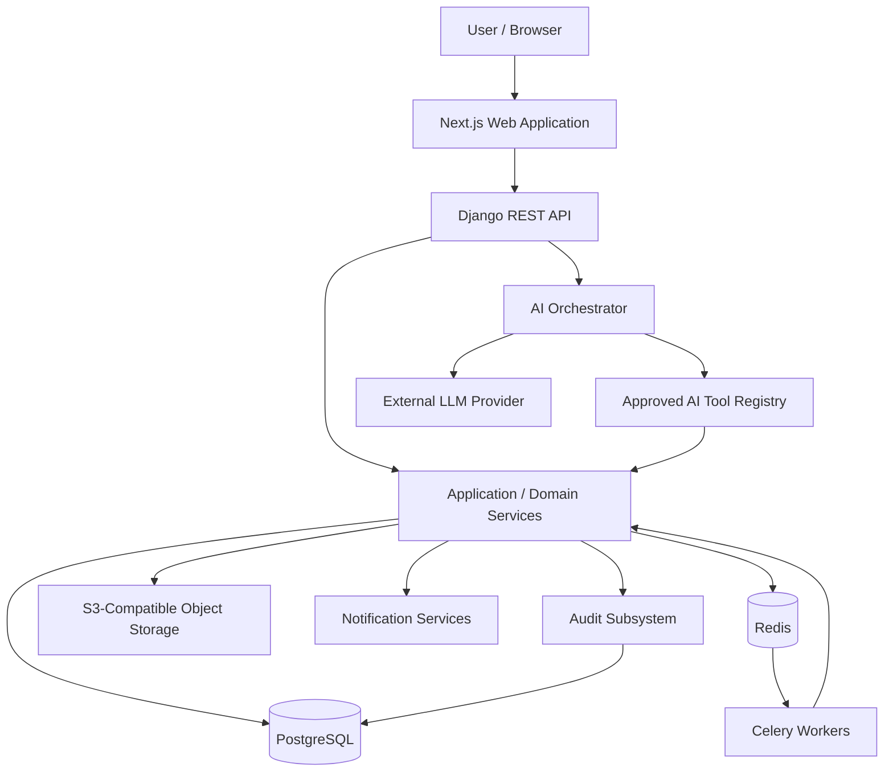
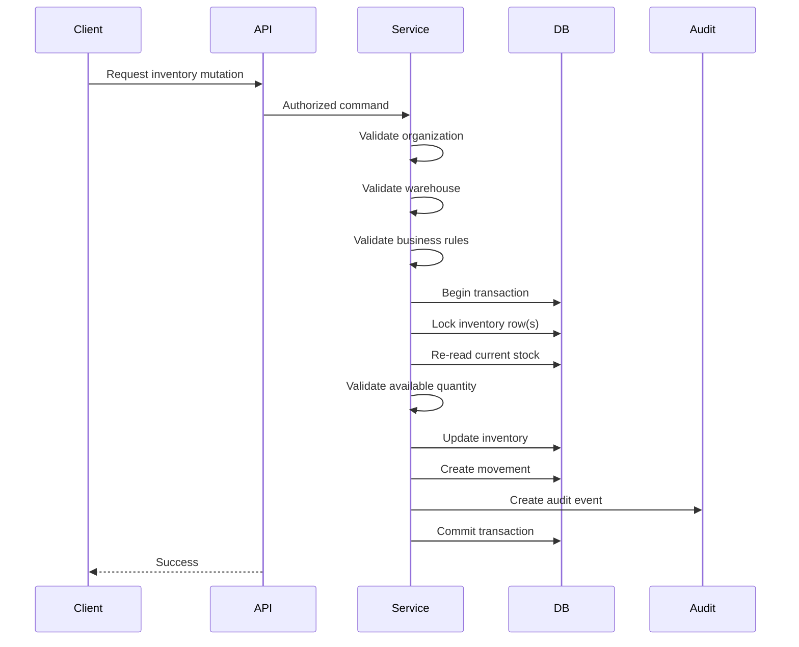
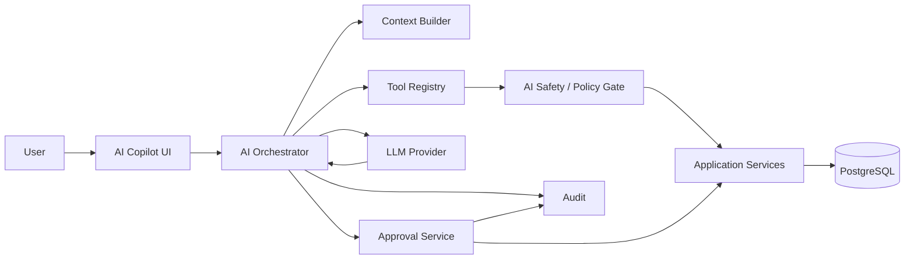

# ARCHITECTURE.md

# Inventory Management AI — System Architecture

**Document Status:** Approved for implementation planning  
**Document Type:** System Architecture Specification  
**Version:** 1.0  
**Date:** 2026-10-04

---

## 1. Purpose

This document defines the production-oriented technical architecture for the Inventory Management AI system.

It translates the approved:

1. Business Requirements Document (BRD)
2. Requirement Decisions
3. Functional Requirements Document (FRD)
4. Business Rules

into a technical structure that can be implemented incrementally.

This document defines **how the system should be structured technically**. It does not replace the BRD, FRD, or Business Rules.

### Source authority

When documents conflict:

1. Confirmed Requirement Decisions
2. Business Rules
3. FRD
4. BRD
5. This architecture document

If a technical decision would require changing an unresolved business decision, the business decision remains open.

---

# 2. Architectural Goals

The architecture must support:

- Multi-tenant organizations
- Role-based access control
- Warehouse-level access restrictions
- Product and catalog management
- Inventory tracking
- Batch/lot and expiry tracking
- Purchasing and receiving
- Customer and sales workflows
- Returns
- Warehouse transfers
- Inventory adjustments
- Weighted Average Cost
- Reporting and dashboards
- Notifications
- Auditability
- AI-powered inventory intelligence
- AI-assisted actions with human approval
- Strong inventory consistency
- Concurrent transaction safety
- Production deployment
- Background processing
- Future horizontal scaling
- Secure external AI integration

The architecture prioritizes:

> correctness → security → data integrity → maintainability → testability → performance → scalability

---

# 3. Technology Stack

## 3.1 Frontend

- Next.js
- TypeScript
- Tailwind CSS
- shadcn/ui
- React Hook Form
- Zod
- TanStack Query

## 3.2 Backend

- Django
- Django REST Framework
- Python

## 3.3 Database

- PostgreSQL

## 3.4 Background Processing

- Celery
- Redis

Redis is used for:

- Celery broker
- Celery result/backend use where appropriate
- short-lived application caching where appropriate
- rate limiting or coordination where justified

Redis must not become the source of truth for inventory or financial data.

## 3.5 Object Storage

S3-compatible object storage for:

- import files
- report exports
- document attachments
- other approved user-uploaded files

## 3.6 AI

Provider-agnostic LLM integration behind an internal AI provider adapter.

The application must not be tightly coupled to a single LLM provider.

## 3.7 Infrastructure

- Docker
- Docker Compose for local development
- GitHub Actions for CI/CD
- Managed PostgreSQL in production
- Managed Redis in production where appropriate
- Container-based application deployment

No specific cloud provider is mandated by the business requirements.

---

# 4. Architectural Principles

## ARCH-001 — Backend owns business rules

The frontend is not a trusted enforcement layer.

All important business rules must be enforced by Django services and/or database constraints.

---

## ARCH-002 — Database is the source of truth

PostgreSQL is authoritative for:

- inventory
- users
- organizations
- products
- suppliers
- customers
- purchasing
- sales
- transfers
- returns
- audit records
- approval records

Caches and AI context are never authoritative.

---

## ARCH-003 — Inventory mutations are service-controlled

Inventory changes must pass through the inventory application/domain service.

No API endpoint, AI tool, background job, or administrative script may directly manipulate inventory quantities while bypassing the inventory service.

---

## ARCH-004 — AI is an application client, not a database client

The AI layer cannot:

- execute arbitrary SQL
- access PostgreSQL directly
- modify database rows directly
- bypass authorization
- bypass validation
- bypass inventory locking
- bypass approval rules

AI operates through approved application tools.

---

## ARCH-005 — Organization isolation is mandatory

Every tenant-scoped request must establish the authenticated organization context.

The client must not be trusted to select an arbitrary organization.

---

## ARCH-006 — Authorization is enforced server-side

Permissions must be checked by backend services.

UI hiding is only a usability mechanism.

---

## ARCH-007 — High-impact AI writes require human approval

AI may recommend or prepare actions.

High-impact actions require explicit human approval before execution.

Approval does not bypass normal validation.

---

## ARCH-008 — Deterministic calculations stay deterministic

The LLM must not be responsible for authoritative arithmetic such as:

- inventory quantities
- available stock
- weighted average cost
- invoice totals
- tax calculations
- payment totals
- reorder calculations where deterministic inputs exist

The backend calculates these values.

The AI may explain them.

---

## ARCH-009 — Audit important state changes

Important business actions must leave an auditable trail.

---

## ARCH-010 — Fail safely

When uncertain, unauthorized, stale, or invalid:

- reject the operation
- preserve data integrity
- provide a useful error
- never silently mutate data

---

# 5. High-Level System Context



---

# 6. Logical Architecture

The system is divided into the following major layers:

```text
Presentation
    ↓
API / Transport
    ↓
Application Services
    ↓
Domain / Business Rules
    ↓
Data Access
    ↓
Infrastructure
```

AI sits beside the normal application interface and uses the same application services through controlled tools.

```text
                         ┌────────────────────┐
                         │    Next.js Web     │
                         └─────────┬──────────┘
                                   │
                              REST API
                                   │
                         ┌─────────▼──────────┐
                         │   Django / DRF     │
                         └─────────┬──────────┘
                                   │
                    ┌──────────────▼──────────────┐
                    │ Application Service Layer   │
                    └──────────────┬──────────────┘
                                   │
                    ┌──────────────▼──────────────┐
                    │ Domain / Business Rules     │
                    └──────────────┬──────────────┘
                                   │
                    ┌──────────────▼──────────────┐
                    │ PostgreSQL / Data Access     │
                    └─────────────────────────────┘

       AI Orchestrator
              │
       Approved Tool Registry
              │
       Application Services
```

---

# 7. Major Components

## 7.1 Next.js Web Application

Responsibilities:

- authentication UI
- navigation
- dashboards
- forms
- tables
- inventory views
- purchasing screens
- sales screens
- reporting
- AI Copilot interface
- approval interfaces
- notifications
- client-side validation
- user experience

The frontend must not contain authoritative business rules.

### Frontend responsibilities

The frontend may:

- validate obvious form input
- display allowed actions
- calculate presentation-only values
- format currency
- format dates
- manage form state
- cache API responses

The frontend must not be the final authority for:

- stock availability
- permissions
- approval eligibility
- purchase approval
- transfer approval
- inventory mutation
- pricing rules
- tax totals
- AI action authorization

---

# 8. Backend Architecture

Django is organized by business capability rather than creating one monolithic application module.

A conceptual structure:

```text
backend/
├── config/
├── apps/
│   ├── organizations/
│   ├── users/
│   ├── catalog/
│   ├── warehouses/
│   ├── inventory/
│   ├── suppliers/
│   ├── purchasing/
│   ├── customers/
│   ├── sales/
│   ├── returns/
│   ├── transfers/
│   ├── reports/
│   ├── notifications/
│   ├── audit/
│   ├── approvals/
│   └── ai/
├── common/
└── manage.py
```

The exact Django app boundaries may evolve during implementation, but business capabilities should remain clearly separated.

---

# 9. Backend Layering

Each capability should follow a consistent internal structure.

Conceptually:

```text
API View
   ↓
Serializer
   ↓
Application Service
   ↓
Domain Rules
   ↓
Repository / Query Layer
   ↓
Django ORM
   ↓
PostgreSQL
```

## 9.1 API layer

Responsible for:

- authentication context
- request parsing
- serializer invocation
- request-level validation
- HTTP status codes
- response serialization
- permission entry points

It should not contain complex business workflows.

---

## 9.2 Serializer layer

Responsible for:

- request schema validation
- response serialization
- type/format validation
- basic field constraints

Serializer validation does not replace domain validation.

---

## 9.3 Application service layer

Responsible for business use cases.

Examples:

```text
ProductService
WarehouseService
InventoryService
PurchaseOrderService
ReceivingService
SalesService
ReturnService
TransferService
ApprovalService
ReportService
NotificationService
AIActionService
```

Services coordinate:

- authorization
- validation
- transactions
- domain rules
- persistence
- audit events
- notifications

---

## 9.4 Domain layer

Contains rules that define valid business state.

Examples:

```text
Available Stock = Sellable Stock - Reserved Stock

Physical Stock = Sellable Stock
                + Damaged Stock
                + Expired Stock

Sellable Stock = Available Stock + Reserved Stock
```

Domain logic must remain independent of the HTTP transport layer.

---

## 9.5 Data access

Django ORM is the primary data access mechanism.

Queries should:

- explicitly scope organization
- apply warehouse authorization
- use indexes
- use transactions for mutations
- use row locking where required

Raw SQL should be exceptional and reviewed.

AI must never generate or execute raw SQL.

---

# 10. Multi-Tenant Architecture

The initial architecture uses a shared application and shared PostgreSQL database with logical tenant isolation.

```text
PostgreSQL
│
├── Organization A
│   ├── Users
│   ├── Products
│   ├── Warehouses
│   ├── Inventory
│   └── Transactions
│
├── Organization B
│   ├── Users
│   ├── Products
│   ├── Warehouses
│   ├── Inventory
│   └── Transactions
│
└── Organization C
```

Tenant data is logically isolated using `organization_id`.

---

## 10.1 Organization context

For each authenticated request:

```text
Authentication
      ↓
Authenticated User
      ↓
Organization Context
      ↓
Role / Warehouse Scope
      ↓
Authorized Query / Service
```

The backend derives organization context from authenticated identity.

A request such as:

```json
{
  "organization_id": "..."
}
```

must never be accepted as proof that the user belongs to that organization.

---

## 10.2 Tenant-scoped tables

Tenant-owned entities should contain an organization relationship where appropriate.

Examples:

- products
- categories
- brands
- warehouses
- inventory
- suppliers
- customers
- purchase orders
- sales
- transfers
- notifications
- AI conversations
- AI action records

Global/reference data may be modeled separately when appropriate.

---

## 10.3 Cross-tenant queries

Cross-tenant queries are prohibited in normal user workflows.

Only explicitly authorized platform-level operations may operate across organizations.

The exact SUPER_ADMIN tenant-data policy remains unresolved under DEC-012.

---

# 11. Authentication Architecture

The browser application should use secure cookie-based authentication.

Recommended production model:

```text
Browser
   │
   │ HTTPS
   ▼
Next.js / API
   │
   ▼
Django Authentication
   │
   └── Secure HttpOnly Cookie
```

Authentication credentials must not be stored in browser `localStorage`.

Cookies should use appropriate:

- `HttpOnly`
- `Secure`
- `SameSite`

settings.

Production deployment should preferably expose the application through a common HTTPS domain/reverse proxy so frontend and API requests operate within a predictable same-site security boundary.

---

# 12. Authorization Architecture

Authorization has two dimensions:

1. organization-level role
2. warehouse-level scope

```text
User
 ├── Organization
 ├── Role
 └── Warehouse Assignments
```

## 12.1 Role hierarchy

Defined roles:

- SUPER_ADMIN
- ADMIN
- MANAGER
- INVENTORY_STAFF
- SALES_STAFF
- VIEWER

The exact permissions are defined by the FRD and Business Rules.

The architecture must centralize permission checks instead of scattering role checks throughout views.

---

## 12.2 Warehouse authorization

Confirmed policy:

- SUPER_ADMIN / ADMIN / MANAGER: all organization warehouses
- INVENTORY_STAFF / SALES_STAFF / VIEWER: assigned warehouses only

Backend queries must apply this restriction.

A frontend selector cannot grant access to an unauthorized warehouse.

---

# 13. Inventory Architecture

Inventory is the highest-integrity subsystem.

The architecture must treat inventory mutations as transactional operations.

---

## 13.1 Inventory state model

```text
Physical Stock
│
├── Sellable Stock
│   ├── Available Stock
│   └── Reserved Stock
│
├── Damaged Stock
│
└── Expired Stock
```

The authoritative invariants are:

```text
Available = Sellable - Reserved

Physical = Sellable + Damaged + Expired

Sellable = Available + Reserved
```

`Available Stock` must not be independently mutated as an unrelated source of truth.

---

# 14. Inventory Mutation Flow

All confirmed inventory-changing workflows use a common pattern.



---

# 15. Database Transactions

Inventory-changing operations must use database transactions.

Conceptually:

```text
BEGIN
    lock relevant inventory row
    read current state
    validate requested quantity
    update inventory state
    create inventory movement
    create audit record
COMMIT
```

If any critical operation fails:

```text
ROLLBACK
```

No partial inventory mutation is permitted.

---

# 16. Concurrency Control

Concurrent sales are explicitly covered by the business rules.

The architecture uses database-level row locking for critical inventory consumption.

Conceptual approach:

```text
Transaction A
    ↓
Lock inventory position
    ↓
Read available = 5
    ↓
Consume 5
    ↓
Commit

Transaction B
    ↓
Waits for lock
    ↓
Reads available = 0
    ↓
Rejects sale
```

This prevents:

```text
available = -5
```

The application must never trust a previously cached stock value for the final mutation decision.

---

# 17. Inventory Movement Ledger

Every confirmed stock change must correspond to an approved movement type.

Movement types include:

- Opening
- Purchase
- Sale
- Purchase Return
- Sales Return
- Adjustment In
- Adjustment Out
- Transfer In
- Transfer Out
- Damage
- Expired

The ledger provides traceability for inventory changes.

---

# 18. Weighted Average Cost

Inventory valuation uses Weighted Average Cost.

The calculation must be implemented deterministically in the backend.

The LLM must not calculate authoritative inventory valuation.

Cost visibility remains controlled by role.

Confirmed rule:

- ADMIN/MANAGER: cost visible
- INVENTORY_STAFF/SALES_STAFF/VIEWER: cost hidden by default

---

# 19. Purchase Architecture

Purchase workflow:

```text
Draft PO
   ↓
Submitted
   ↓
Approval
   ↓
Approved
   ↓
Receiving
   ↓
Inventory Updated
```

Submitted purchase orders require ADMIN/MANAGER approval.

Purchase orders themselves do not reserve inventory.

Receiving creates the appropriate inventory movement and updates inventory atomically.

---

# 20. Sales Architecture

Sales workflow:

```text
Draft
   ↓
Confirmed
   ↓
Reserved
   ↓
Completed
```

Confirmed sales reserve stock.

Completion:

- consumes the reserved stock
- reduces physical/sellable stock as applicable
- releases the reservation

Draft sales do not reserve stock.

Normal sales do not require approval.

Unusual cancellation/override scenarios may require manager/admin authorization.

Partial sales fulfillment remains dependent on unresolved DEC-015 and must not be silently assumed by implementation.

---

# 21. Transfer Architecture

Transfers between warehouses require:

```text
Draft
   ↓
Submitted
   ↓
Manager/Admin Approval
   ↓
Execution
   ↓
Transfer Out + Transfer In
```

The source and destination inventory updates must be treated as one controlled business operation where possible.

A transfer must not create an inconsistent state in which stock disappears from both warehouses or appears in both.

---

# 22. Return Architecture

## Purchase returns

Stock decreases according to the confirmed purchase-return workflow.

Draft returns do not change inventory.

## Customer returns

Returned goods require inspection.

Possible outcomes:

```text
Returned
   ├── Acceptable → Sellable Stock
   ├── Damaged → Damaged Stock
   └── Expired → Expired Stock
```

The returned item must not automatically become sellable before inspection.

---

# 23. Approval Architecture

Approval is a first-class subsystem.

Conceptual model:

```text
Action Request
      ↓
Approval Required?
      ↓
 ┌────┴────┐
 No        Yes
 │          │
Execute   Pending
            ↓
       Human Review
         ↓      ↓
      Approve  Reject
         ↓
   Revalidate
         ↓
      Execute
```

Approval records should retain:

- requesting user
- organization
- action type
- affected resources
- requested values
- current status
- approver
- approval/rejection timestamp
- reason where required
- execution result

---

# 24. AI Architecture

AI is implemented as a controlled application subsystem.



---

# 25. AI Orchestrator

The AI Orchestrator coordinates:

- user intent
- organization context
- authorization context
- conversation state
- approved tools
- tool execution
- AI provider calls
- structured outputs
- confidence/freshness information
- safety checks
- approval workflows

The orchestrator is not allowed to bypass normal application services.

---

# 26. AI Tool Registry

AI capabilities are exposed through an allowlisted tool registry.

Potential read tools include:

```text
get_inventory_summary
get_low_stock_items
get_stock_movements
get_sales_summary
get_demand_history
get_purchase_pipeline
get_supplier_performance
get_product_information
get_warehouse_inventory
get_inventory_anomalies
get_recent_business_activity
```

Potential write/draft tools include:

```text
create_purchase_order_draft
create_transfer_draft
create_inventory_adjustment_draft
create_reorder_recommendation
create_report_request
```

Exact tools will be finalized during API and AI specification.

---

# 27. AI Tool Execution Boundary

Every tool execution follows:

```text
AI Tool Request
      ↓
Tool Schema Validation
      ↓
Authenticated User Context
      ↓
Organization Scope
      ↓
Warehouse Scope
      ↓
Permission Check
      ↓
Business Rule Validation
      ↓
Application Service
      ↓
Database
```

AI never receives unrestricted database access.

---

# 28. AI Read Requests

Example:

> "Which products are below their reorder point?"

Flow:

```text
User
 ↓
AI Orchestrator
 ↓
Interpret intent
 ↓
get_low_stock_items
 ↓
Permission check
 ↓
Inventory service
 ↓
PostgreSQL
 ↓
Structured result
 ↓
LLM explanation
 ↓
User
```

The authoritative numbers originate from the application/database.

---

# 29. AI Write Requests

Example:

> "Create a purchase order for the products that are low in stock."

The AI must not directly execute the purchase order.

Flow:

```text
User request
    ↓
AI interprets request
    ↓
Read inventory
    ↓
Generate recommendation
    ↓
Create draft PO
    ↓
Human reviews
    ↓
Approval
    ↓
Normal PurchaseOrderService
    ↓
Final validation
    ↓
Execution
```

---

# 30. Human Approval and Revalidation

A critical rule:

> Approval is not permission to skip validation.

When a user approves an AI-generated action:

1. Reload current data.
2. Verify the approval is still valid.
3. Re-check authorization.
4. Re-check organization.
5. Re-check warehouse scope.
6. Re-check business rules.
7. Re-check relevant inventory state.
8. Execute through the normal application service.
9. Record audit information.

If conditions changed, execution must fail safely and request review again where appropriate.

---

# 31. AI Freshness

AI responses involving operational data should communicate data freshness.

Examples:

```text
Data retrieved just now.
```

or:

```text
Based on inventory data retrieved 8 minutes ago.
```

Cached data must not be presented as live without appropriate indication.

---

# 32. AI Confidence

The system should distinguish:

- factual result
- deterministic calculation
- prediction
- recommendation
- proposed action

The UI should not present predictions or recommendations as confirmed facts.

---

# 33. AI Prompt Injection Protection

User-controlled data can contain instructions intended to manipulate the AI.

Potential sources:

- product names
- supplier names
- customer names
- notes
- uploaded documents
- imported CSV values
- descriptions

These values must be treated as **data**, not trusted instructions.

The AI system must maintain a clear separation between:

```text
System instructions
Developer/application rules
Tool definitions
User request
Retrieved business data
Untrusted content
```

Untrusted business content must never override system or application policy.

---

# 34. AI Provider Boundary

The application should use an internal provider abstraction.

Conceptually:

```text
AI Orchestrator
      ↓
AI Provider Interface
      ↓
Provider Adapter
      ↓
External LLM
```

This allows the system to change providers without rewriting the AI business layer.

Provider-specific SDK calls must remain inside the adapter boundary.

---

# 35. AI Numeric Integrity

Authoritative calculations must use backend services.

Examples:

```text
Inventory quantity
Available stock
Reserved stock
Weighted average cost
Purchase totals
Sales totals
Tax totals
Payment totals
Demand calculations
Reorder calculations
```

The AI may explain a calculation using values supplied by the backend.

---

# 36. Frontend Architecture

Recommended conceptual structure:

```text
frontend/
├── app/
├── components/
├── features/
│   ├── auth/
│   ├── dashboard/
│   ├── catalog/
│   ├── inventory/
│   ├── purchasing/
│   ├── sales/
│   ├── suppliers/
│   ├── customers/
│   ├── transfers/
│   ├── reports/
│   ├── notifications/
│   ├── approvals/
│   └── ai/
├── lib/
├── hooks/
├── schemas/
└── types/
```

Feature-specific business UI should remain inside its feature boundary.

Shared components belong in shared component libraries.

---

# 37. Frontend Data Flow

Recommended flow:

```text
React UI
   ↓
TanStack Query / Mutation
   ↓
API Client
   ↓
Django REST API
```

TanStack Query should manage:

- server-state caching
- loading states
- retries where appropriate
- invalidation
- mutation states

The frontend should not duplicate backend business state unnecessarily.

---

# 38. Frontend Validation

Use Zod for client-side form validation.

However:

```text
Zod validation
     ≠
Backend validation
     ≠
Database constraints
```

All three have different responsibilities.

Client validation improves UX.

Backend validation protects the system.

Database constraints protect data integrity.

---

# 39. API Architecture

The system uses REST APIs.

Base path:

```text
/api/v1/
```

Conceptual endpoints:

```text
/api/v1/auth/
/api/v1/organizations/
/api/v1/users/
/api/v1/products/
/api/v1/categories/
/api/v1/brands/
/api/v1/units/
/api/v1/warehouses/
/api/v1/inventory/
/api/v1/suppliers/
/api/v1/purchase-orders/
/api/v1/receiving/
/api/v1/customers/
/api/v1/sales/
/api/v1/returns/
/api/v1/transfers/
/api/v1/reports/
/api/v1/notifications/
/api/v1/approvals/
/api/v1/ai/
```

Exact endpoint contracts belong in the API Specification document.

---

# 40. API Error Model

The API should return consistent machine-readable errors.

Conceptual structure:

```json
{
  "error": {
    "code": "INSUFFICIENT_AVAILABLE_STOCK",
    "message": "The requested quantity is greater than available stock.",
    "details": {}
  }
}
```

Error codes should be stable enough for frontend behavior and testing.

Sensitive implementation details must not be exposed.

---

# 41. Inventory Error Handling

Examples:

```text
INSUFFICIENT_AVAILABLE_STOCK
UNAUTHORIZED_WAREHOUSE
PRODUCT_INACTIVE
INVALID_BATCH
EXPIRED_BATCH
INVALID_QUANTITY
TRANSFER_NOT_APPROVED
PURCHASE_ORDER_NOT_APPROVED
STALE_APPROVAL
CONCURRENT_UPDATE_CONFLICT
```

Exact error taxonomy will be finalized during API specification.

---

# 42. Background Processing

Celery handles work that should not block an HTTP request.

Potential tasks:

- notification delivery
- report generation
- large data imports
- scheduled AI briefing
- anomaly analysis
- demand calculations
- cleanup tasks
- export generation
- email delivery
- asynchronous file processing

Background tasks must remain idempotent where retries are possible.

---

# 43. Celery Reliability

Tasks should support:

- retries
- bounded retry count
- exponential/backoff behavior where appropriate
- idempotency
- failure logging
- operational visibility

A retry must not duplicate a business action.

For high-impact mutations, use explicit idempotency controls and application-level transaction handling.

---

# 44. Redis Architecture

Redis is not the system of record.

Use Redis for:

- Celery broker
- transient cache
- short-lived coordination
- rate limiting where needed

Do not store authoritative:

- inventory quantities
- purchase state
- sales state
- approval state
- audit state

only in Redis.

---

# 45. Notifications

Notifications are generated by application events.

Examples:

```text
Low stock
Purchase approval required
Transfer approval required
AI action awaiting approval
Inventory anomaly
Report ready
Import completed
System error requiring attention
```

The notification subsystem should support:

```text
Application Event
      ↓
Notification Service
      ↓
Persist notification
      ↓
Optional asynchronous delivery
```

The initial delivery channels should remain implementation-configurable.

---

# 46. Audit Architecture

Audit logging records important business events.

Examples:

- login/security events
- role changes
- product changes
- inventory adjustments
- stock movements
- purchase approvals
- transfer approvals
- sales overrides
- returns
- AI requests
- AI tool calls
- AI recommendations
- AI action approvals
- AI action execution
- administrative changes

Audit records should contain enough context to reconstruct what happened without exposing secrets.

---

# 47. Audit vs Inventory Ledger

These are different concepts.

### Inventory ledger

Answers:

> What happened to stock?

### Audit log

Answers:

> Who performed or initiated the action, when, and through what workflow?

A single business event may therefore create both:

```text
Inventory Movement
+
Audit Event
```

---

# 48. File Storage Architecture

Files should not be stored directly inside PostgreSQL as the primary binary storage mechanism.

Recommended:

```text
Django
  ↓
Object Storage
```

PostgreSQL stores metadata such as:

- object key
- filename
- content type
- size
- uploader
- organization
- timestamps
- processing status

---

# 49. File Upload Security

Uploads must be validated for:

- organization scope
- authorization
- file size
- file type
- extension
- content type
- filename safety

Uploaded content must be treated as untrusted.

AI processing of uploaded files must not automatically trust instructions contained inside those files.

---

# 50. Reporting Architecture

Reports should use backend query services.

Conceptual flow:

```text
Report Request
     ↓
Authorization
     ↓
Report Service
     ↓
Optimized PostgreSQL Queries
     ↓
Report Dataset
     ↓
Response / Export
```

Large exports should be asynchronous.

---

# 51. AI Reporting

AI-generated summaries must be based on authorized report datasets.

Flow:

```text
Report Service
     ↓
Structured Dataset
     ↓
AI Summarization
     ↓
Natural Language Summary
```

The AI should not independently query unrestricted operational tables.

---

# 52. Observability

The production system should provide:

## Logs

Structured application logs containing:

- request ID
- organization context where safe
- user context where safe
- operation
- duration
- result
- error code

Do not log secrets or sensitive authentication data.

## Metrics

Track:

- API latency
- error rate
- database latency
- Celery queue depth
- task failures
- AI latency
- AI tool failures
- approval turnaround
- inventory mutation failures

## Traces

Distributed tracing may be introduced for:

```text
Browser/API
 → Django
 → service
 → database
 → Celery / AI provider
```

---

# 53. Request Correlation

Requests should carry a correlation/request identifier.

Example:

```text
Request ID
    ↓
API log
    ↓
Service log
    ↓
Database-related log
    ↓
Celery task
    ↓
Audit event where appropriate
```

This helps diagnose production workflows.

---

# 54. Security Architecture

Primary security boundaries:

```text
Browser
   │
 HTTPS
   ▼
Frontend / API Gateway
   │
 Authentication
   ▼
Django API
   │
 Authorization
   ▼
Application Services
   │
 Business Rules
   ▼
PostgreSQL
```

AI is a separate boundary:

```text
Django
   ↓
AI Orchestrator
   ↓
Tool Registry
   ↓
Application Services
```

AI must never cross directly into the database boundary.

---

# 55. Security Controls

Required controls include:

- HTTPS in production
- secure authentication cookies
- CSRF protection where applicable
- server-side authorization
- organization isolation
- warehouse scope enforcement
- input validation
- output encoding
- SQL injection protection through ORM/parameterized queries
- rate limiting where appropriate
- secure secret management
- dependency updates
- audit logging
- safe file uploads
- AI prompt-injection defenses
- no arbitrary AI SQL
- no sensitive tokens in localStorage

---

# 56. Database Integrity

PostgreSQL constraints should enforce invariants wherever practical.

Examples:

- foreign keys
- unique constraints
- composite unique constraints
- check constraints
- non-null constraints
- appropriate indexes

Application logic remains responsible for multi-step business invariants.

Database constraints are the final integrity boundary.

---

# 57. Indexing Strategy

Indexes should support common access patterns.

Likely candidates include combinations involving:

```text
organization_id
warehouse_id
product_id
supplier_id
customer_id
status
created_at
updated_at
expiry_date
batch/lot identifier
```

Exact indexes must be determined from the database design and query patterns rather than indiscriminately indexing every field.

---

# 58. Caching Strategy

Caching is allowed only where stale data is acceptable.

Good candidates:

- reference data
- static configuration
- dashboard aggregates where freshness is communicated
- non-critical metadata

Avoid caching authoritative stock availability for final transaction decisions.

Before a stock mutation:

> Always re-read authoritative inventory state from PostgreSQL inside the transaction.

---

# 59. Deployment Architecture

## Local

```text
Docker Compose
├── Next.js
├── Django
├── PostgreSQL
├── Redis
└── Celery Worker
```

Optional development services may include a Celery scheduler and local object-storage-compatible service.

---

## Staging

```text
HTTPS
  ↓
Reverse Proxy / Ingress
  ├── Next.js
  └── Django
        ↓
Managed PostgreSQL
        ↓
Managed Redis
        ↓
Object Storage
```

---

## Production

```text
                     ┌───────────────┐
                     │   Internet    │
                     └───────┬───────┘
                             │
                           HTTPS
                             │
                    ┌────────▼────────┐
                    │ Ingress / Proxy │
                    └───────┬────────┘
                            / \
                           /   \
                          /     \
                  ┌──────▼┐   ┌─▼──────┐
                  │Next.js│   │ Django │
                  └───────┘   └───┬────┘
                                  │
                     ┌────────────┼────────────┐
                     │            │            │
                PostgreSQL      Redis       Storage
                     │            │
                     │         Celery
                     │            │
                     └──────┬─────┘
                            │
                         Workers
```

Exact cloud topology remains provider-dependent.

---

# 60. Docker Architecture

Containers should be independently buildable.

Conceptual services:

```text
web
api
worker
scheduler
postgres
redis
```

Production should preferably use managed PostgreSQL/Redis instead of self-hosting database infrastructure inside application containers.

Containers should be:

- immutable
- environment-configured
- non-secret-bearing
- health-checkable

---

# 61. Configuration Management

Configuration must come from environment variables or a secure configuration system.

Examples:

```text
DATABASE_URL
REDIS_URL
SECRET_KEY
ALLOWED_HOSTS
CORS configuration
OBJECT_STORAGE credentials
AI provider configuration
EMAIL configuration
```

Secrets must not be committed to Git.

A `.env.example` file may contain placeholders only.

---

# 62. Environment Separation

Minimum environments:

```text
development
staging
production
```

Each environment should have separate:

- databases
- credentials
- secrets
- object storage locations
- AI provider credentials where applicable

Production data must never be casually copied into development.

---

# 63. Database Backup and Recovery

Production PostgreSQL must have:

- automated backups
- point-in-time recovery where supported
- defined retention
- restore testing

A backup that has never been restored/tested should not be treated as a proven recovery strategy.

---

# 64. Reliability

The architecture should support:

- retry-safe background tasks
- transactional inventory operations
- graceful API errors
- health checks
- database backup
- service restart recovery
- idempotent operations where needed
- monitoring
- auditability

---

# 65. Health Checks

At minimum:

```text
/api/health/live
/api/health/ready
```

Conceptually:

### Liveness

Answers:

> Is the application process alive?

### Readiness

Answers:

> Can the application serve requests with required dependencies available?

Readiness may check required dependencies such as PostgreSQL and Redis depending on endpoint purpose.

---

# 66. Performance Architecture

Initial performance priorities:

1. Correctness
2. Proper database indexes
3. Efficient query design
4. Avoid N+1 queries
5. Pagination
6. Asynchronous heavy work
7. Appropriate caching
8. Connection pooling
9. Background processing

Do not prematurely optimize before real query patterns exist.

---

# 67. Pagination

Large datasets must not be returned in a single API response.

Pagination should be used for:

- products
- inventory
- movements
- suppliers
- customers
- purchase orders
- sales
- audit logs
- notifications

Exact pagination format belongs in the API specification.

---

# 68. API Rate Limiting

Rate limiting should be applied especially to:

- authentication endpoints
- AI endpoints
- expensive report generation
- file uploads
- public/unauthenticated endpoints if introduced

AI requests may require stricter limits because they can be expensive.

---

# 69. Testing Architecture

Testing should exist at multiple levels.

## Unit tests

Test:

- business rules
- calculation services
- validators
- permission functions
- AI tool schemas

## Integration tests

Test:

- service + PostgreSQL
- transactions
- inventory movements
- approval flows
- authorization
- Celery workflows

## API tests

Test:

- status codes
- validation
- authorization
- response schemas
- tenant isolation

## Frontend tests

Test:

- important forms
- permissions
- critical interactions
- loading/error states

## End-to-end tests

Test critical workflows:

```text
Create product
→ Receive inventory
→ Sell product
→ Reserve stock
→ Complete sale
→ Verify movement
→ Verify audit
```

and:

```text
AI recommendation
→ Draft action
→ Human approval
→ Revalidation
→ Execution
→ Audit
```

---

# 70. Multi-Tenant Security Tests

A dedicated test suite must verify that one organization cannot access another organization's data.

Examples:

```text
Org A product ID
    ↓
Org B request
    ↓
403 / not found according to API policy
```

Test this across:

- products
- inventory
- warehouses
- suppliers
- customers
- purchase orders
- sales
- transfers
- reports
- AI tools
- audit data

---

# 71. Warehouse Scope Tests

For restricted roles:

```text
Assigned Warehouse
    → allowed

Unassigned Warehouse
    → denied
```

This must be tested at API/service level, not only in the UI.

---

# 72. Inventory Concurrency Tests

At least one integration test must intentionally execute competing stock-consuming transactions.

Expected result:

```text
Available stock never becomes negative.
```

If only one unit is available and two transactions attempt to consume it:

```text
Transaction A → success
Transaction B → graceful failure
```

The test must verify the database state afterward.

---

# 73. AI Security Tests

Test that the AI cannot:

- request arbitrary SQL
- access another organization
- access unauthorized warehouses
- execute high-impact actions without approval
- treat product text as system instructions
- bypass normal validation
- expose hidden cost data to unauthorized roles

---

# 74. CI/CD Architecture

GitHub Actions should perform at minimum:

```text
Push / Pull Request
        ↓
Lint
        ↓
Type checks
        ↓
Backend tests
        ↓
Frontend tests
        ↓
Security/dependency checks
        ↓
Build
        ↓
Deployment pipeline
```

Production deployment should require passing CI.

---

# 75. Migration Strategy

Database schema changes must use Django migrations.

Rules:

- never manually alter production schema without a controlled migration
- review migrations
- test migrations against realistic data
- avoid destructive changes without a migration plan
- use staged migrations for breaking changes

---

# 76. Data Lifecycle

Data retention is still unresolved under DEC-011.

Therefore the architecture does not impose a final retention period.

However, the system must be designed so that retention policies can later be implemented for:

- audit data
- notifications
- AI conversations
- generated reports
- uploaded files
- transactional records where legally/business-wise appropriate

Deletion or archival must never violate audit or financial requirements established later.

---

# 77. SUPER_ADMIN Data Access

DEC-012 remains unresolved.

The architecture therefore separates:

```text
Platform administration
```

from:

```text
Tenant operational data access
```

A SUPER_ADMIN authorization layer should exist so the final policy can be introduced without redesigning the entire system.

Do not assume unrestricted tenant-data access.

---

# 78. Multi-Organization Users

DEC-013 remains unresolved.

The architecture should avoid hard-coding a single organization relationship so tightly that future multi-organization membership becomes impossible.

A future-compatible conceptual model is:

```text
User
  ↓
Organization Membership
  ├── Organization
  ├── Role
  └── Warehouse Scope
```

The initial implementation may enforce one active organization if that is selected by the unresolved business decision.

---

# 79. Partial Sales Fulfillment

DEC-015 remains unresolved.

Sales services must therefore isolate fulfillment logic so that the final policy can support either:

```text
Full fulfillment only
```

or:

```text
Partial fulfillment
```

without rewriting product, inventory, and sales foundations.

---

# 80. Invoicing Depth

DEC-016 remains unresolved.

Sales architecture should separate:

```text
Sale transaction
```

from:

```text
Invoice/document generation
```

This allows the final invoicing depth to be introduced without changing inventory fundamentals.

---

# 81. Payment Recording

DEC-017 remains unresolved.

Payment records should be treated as a separate concern from inventory consumption.

Do not assume a full accounting/payment subsystem.

---

# 82. Commercial Pricing Model

DEC-001 remains unresolved.

Architecture should support organization-level commercial configuration without hard-coding:

- subscription pricing
- SaaS billing tiers
- commissions
- per-user billing
- per-warehouse billing

Those are product/business decisions rather than inventory-domain architecture decisions.

---

# 83. Organization Scale

DEC-002 remains unresolved.

The architecture should support growth without assuming an exact tenant count.

The initial design uses:

```text
Shared application
+
Shared PostgreSQL database
+
Logical tenant isolation
```

If scale later requires database partitioning, sharding, or tenant isolation changes, the service boundaries should make that evolution possible.

---

# 84. Architectural Data Flow — Normal Request

```text
Browser
   ↓
Next.js
   ↓
Django API
   ↓
Authentication
   ↓
Authorization
   ↓
Serializer Validation
   ↓
Application Service
   ↓
Domain Rules
   ↓
PostgreSQL Transaction
   ↓
Audit / Notification
   ↓
API Response
   ↓
Next.js UI
```

---

# 85. Architectural Data Flow — Inventory Mutation

```text
User
 ↓
Sales / Inventory UI
 ↓
API
 ↓
Authorization
 ↓
Inventory Service
 ↓
BEGIN TRANSACTION
 ↓
SELECT ... FOR UPDATE
 ↓
Read current stock
 ↓
Apply business rules
 ↓
Update inventory
 ↓
Create movement
 ↓
Create audit event
 ↓
COMMIT
 ↓
Notification/event if required
 ↓
Response
```

---

# 86. Architectural Data Flow — AI Read

```text
User
 ↓
AI Copilot
 ↓
AI Orchestrator
 ↓
Intent interpretation
 ↓
Approved Tool
 ↓
Authorization
 ↓
Application Service
 ↓
PostgreSQL
 ↓
Structured result
 ↓
AI explanation
 ↓
User
```

---

# 87. Architectural Data Flow — AI Write

```text
User
 ↓
AI Copilot
 ↓
AI Orchestrator
 ↓
Read authorized data
 ↓
Generate recommendation
 ↓
Create draft action
 ↓
Approval record
 ↓
Human review
 ↓
Approve
 ↓
Revalidate
 ↓
Normal Application Service
 ↓
Transactional execution
 ↓
Audit
 ↓
Result
```

---

# 88. Event-Oriented Opportunities

The system should use explicit domain/application events where useful.

Potential events:

```text
InventoryChanged
PurchaseOrderSubmitted
PurchaseOrderApproved
GoodsReceived
SaleConfirmed
SaleCompleted
TransferApproved
TransferCompleted
LowStockDetected
AIActionCreated
AIActionApproved
AIActionRejected
ReportGenerated
```

Events should not replace transactional business logic.

They are useful for:

- notifications
- background processing
- analytics
- AI context updates
- integrations

---

# 89. Domain Events and Transactions

Where an event represents a committed business fact:

```text
Database transaction
     ↓
Commit
     ↓
Event becomes publishable
```

Do not send an external side effect before the transaction is safely committed unless the operation is explicitly designed for it.

For critical integrations, an outbox pattern may be introduced.

---

# 90. Outbox Pattern

If reliable event delivery becomes necessary:

```text
Business Transaction
   ├── Business Data
   └── Outbox Event
          ↓
       Commit
          ↓
   Background Publisher
          ↓
   External Consumer
```

This prevents the classic failure:

```text
Database committed
but event was never published
```

The outbox pattern may be introduced when external integrations require stronger delivery guarantees.

---

# 91. Caching and AI Context

AI conversation context must not be treated as authoritative business state.

If the AI says:

> "You have 20 units"

the system should be able to retrieve current inventory again before taking any action.

For high-impact actions:

```text
Conversation context
       ↓
Reference only
       ↓
Fresh database state
       ↓
Revalidation
       ↓
Execution
```

---

# 92. Security Boundary for AI-Generated Content

AI-generated content should be treated as untrusted until validated.

Examples:

- generated purchase descriptions
- supplier messages
- report narratives
- recommended quantities
- draft action parameters

Structured output schemas should reject malformed tool parameters.

The application remains responsible for final validation.

---

# 93. Idempotency

Idempotency is required where duplicate requests could cause harmful effects.

Important candidates:

- inventory mutations
- receiving
- sales completion
- transfer execution
- AI action execution
- payment recording if later introduced
- external notifications

An idempotency key or equivalent mechanism should be considered for externally retried requests.

---

# 94. Transaction Boundary Rules

A business transaction should include all changes that must succeed or fail together.

Example:

```text
Sale completion
 ├── inventory decrease
 ├── reservation release
 ├── inventory movement
 └── audit event
```

These should be coordinated within an appropriate transaction boundary.

Notifications can normally occur after commit or asynchronously.

---

# 95. Separation of Concerns

Avoid this pattern:

```text
View
 ├── inventory calculations
 ├── SQL
 ├── authorization
 ├── email
 ├── AI call
 └── business rules
```

Prefer:

```text
View
 ↓
Serializer
 ↓
Service
 ├── Domain rules
 ├── Repository/query
 ├── Audit
 └── Events
```

This makes the system testable and maintainable.

---

# 96. Avoiding a Distributed Monolith

Although the architecture has multiple services/components, the initial application should remain a modular monolith.

Recommended:

```text
One Django application
+
Clear domain modules
+
One PostgreSQL database
+
Celery workers
+
AI provider boundary
```

Do not introduce microservices prematurely.

The domain boundaries should be strong enough to permit future extraction if scale demands it.

---

# 97. Modular Monolith Rationale

A modular monolith provides:

- simpler deployment
- simpler transactions
- easier local development
- easier debugging
- lower infrastructure complexity
- strong module boundaries
- easier learning and maintenance
- future extraction capability

Inventory consistency particularly benefits from keeping related operations within one transaction-capable application.

---

# 98. API-to-Service Rule

API endpoints should call application services.

Example:

```text
POST /api/v1/inventory/adjustments
          ↓
InventoryAdjustmentService
```

Not:

```text
POST /api/v1/inventory/adjustments
          ↓
ORM update()
```

This prevents business rules from being bypassed.

---

# 99. AI-to-Service Rule

AI tools must call application services.

Example:

```text
create_purchase_order_draft
          ↓
PurchaseOrderService
```

Not:

```text
AI
 ↓
ORM
 ↓
Database
```

This is a hard architectural boundary.

---

# 100. Authorization-to-Service Rule

Authorization must be evaluated before sensitive business operations.

The final service should still enforce critical rules because services may be called from:

- API
- Celery
- AI tools
- management commands
- future integrations

---

# 101. Management Commands

Administrative scripts and Django management commands must not bypass business services for business mutations.

Example:

```text
Import Opening Stock
        ↓
OpeningStockService
        ↓
InventoryService
```

rather than:

```text
Import Script
        ↓
Direct ORM update
```

---

# 102. Data Import Architecture

Large imports should use:

```text
Upload
 ↓
Object Storage
 ↓
Import Job
 ↓
Parse
 ↓
Validate
 ↓
Preview / Error Report
 ↓
Authorized Commit
 ↓
Normal Application Services
```

Imports must not bypass inventory and tenant rules.

---

# 103. Scheduled AI Briefing

The AI daily briefing should follow:

```text
Celery Scheduler
      ↓
Briefing Job
      ↓
Authorized Report Queries
      ↓
Structured Metrics
      ↓
AI Summarization
      ↓
Notification
```

The briefing should clearly distinguish:

- observed facts
- calculations
- predictions
- recommendations

---

# 104. Anomaly Detection

Anomaly detection should be separated from authoritative transaction processing.

```text
Operational Data
      ↓
Detection Service
      ↓
Potential Anomaly
      ↓
AI / Rules Explanation
      ↓
Notification / Review
```

An anomaly detector must not silently alter inventory.

---

# 105. Demand and Reorder Analysis

The architecture separates:

```text
Raw transactional data
        ↓
Deterministic analytics
        ↓
Demand metrics
        ↓
Recommendation logic
        ↓
AI explanation
```

AI may improve interpretation but does not replace deterministic data processing.

---

# 106. Supplier Recommendation

Supplier recommendations should use authorized supplier and purchasing data.

Possible inputs:

- purchase history
- lead time
- price history
- fulfillment performance
- return history
- reliability indicators

The recommendation must be labeled as a recommendation rather than a guaranteed outcome.

---

# 107. AI Action Types

AI actions should be classified by impact.

### Read

No mutation.

### Draft

Creates a reviewable object.

### High-impact action

Requires human approval.

Examples likely include:

- purchase order creation/submission
- inventory adjustment
- transfer
- other material stock-changing operations

The final action taxonomy belongs to the AI/API specification.

---

# 108. Approval Expiration / Staleness

Approval records should support stale-state detection.

Example:

```text
AI recommends purchase quantity = 100
       ↓
User waits
       ↓
Inventory changes
       ↓
Approval submitted
       ↓
System re-checks
       ↓
Old recommendation may no longer be valid
```

The action should be revalidated rather than blindly executed.

---

# 109. API Versioning

Public API paths should be versioned:

```text
/api/v1/
```

Breaking API changes should use a new version or controlled migration strategy.

Internal service interfaces do not need public versioning but should maintain stable module contracts.

---

# 110. Documentation Architecture

Documentation should live alongside the codebase.

Recommended:

```text
docs/
├── BRD.md
├── REQUIREMENT-DECISIONS.md
├── FRD.md
├── BUSINESS-RULES.md
├── ARCHITECTURE.md
├── DATABASE-DESIGN.md
├── API-SPECIFICATION.md
├── UI-SPECIFICATION.md
├── AI-SPECIFICATION.md
└── ADR/
```

The implementation should reference these documents rather than re-inventing requirements inside code comments.

---

# 111. Architecture Decision Records

Important technical decisions should be recorded as ADRs.

Initial ADR candidates:

```text
ADR-001 Modular Monolith
ADR-002 Django + DRF
ADR-003 PostgreSQL
ADR-004 Weighted Average Cost
ADR-005 Inventory Row Locking
ADR-006 AI Tool Boundary
ADR-007 Human Approval for AI Writes
ADR-008 Cookie-Based Authentication
ADR-009 Celery + Redis
ADR-010 Shared Database Multi-Tenancy
```

ADR documents should record:

- context
- decision
- alternatives
- consequences

---

# 112. Implementation Dependency Order

Architecture should be implemented in dependency order.

```text
1. Repository / project foundation
        ↓
2. Docker development environment
        ↓
3. Django project
        ↓
4. PostgreSQL connection
        ↓
5. Organization + user foundation
        ↓
6. Authentication
        ↓
7. Roles / permissions
        ↓
8. Catalog
        ↓
9. Warehouses
        ↓
10. Inventory core
        ↓
11. Inventory movements
        ↓
12. Purchasing
        ↓
13. Receiving
        ↓
14. Customers / sales
        ↓
15. Returns
        ↓
16. Transfers
        ↓
17. Reports
        ↓
18. Notifications / audit
        ↓
19. AI foundation
        ↓
20. AI read tools
        ↓
21. AI recommendations
        ↓
22. AI draft actions
        ↓
23. Approval workflow
        ↓
24. AI high-impact execution
```

---

# 113. What Must Not Be Implemented Yet

Before the next specification is complete, do not prematurely implement:

- final database schema
- exact API endpoint contracts
- exact UI layouts
- final AI prompts
- provider-specific AI workflows
- payment/accounting system
- full tax engine
- serial number tracking
- subscription billing
- microservices
- arbitrary AI SQL access

These belong to later design/specification phases or future scope.

---

# 114. Architecture Risks

## Risk 1 — Inventory mutation bypass

**Mitigation:** centralized InventoryService + tests + code review.

## Risk 2 — Tenant data leakage

**Mitigation:** organization context + scoped queries + isolation tests.

## Risk 3 — AI overreach

**Mitigation:** tool registry + service boundary + approval gate.

## Risk 4 — Race conditions

**Mitigation:** PostgreSQL transactions + row locking + concurrency tests.

## Risk 5 — Duplicate background execution

**Mitigation:** idempotent tasks + idempotency controls.

## Risk 6 — Excessive coupling

**Mitigation:** modular monolith + service boundaries.

## Risk 7 — Premature microservices

**Mitigation:** keep deployment modular but centralized initially.

## Risk 8 — Stale AI recommendations

**Mitigation:** freshness indicators + revalidation before writes.

---

# 115. Definition of Architecture Complete

Architecture is considered complete when:

- [ ] major system components are defined
- [ ] frontend/backend boundaries are defined
- [ ] backend layers are defined
- [ ] tenant isolation architecture is defined
- [ ] authorization architecture is defined
- [ ] inventory transaction model is defined
- [ ] concurrency strategy is defined
- [ ] AI boundaries are defined
- [ ] human approval architecture is defined
- [ ] background processing is defined
- [ ] audit architecture is defined
- [ ] notification architecture is defined
- [ ] storage architecture is defined
- [ ] deployment environments are defined
- [ ] observability requirements are defined
- [ ] testing architecture is defined
- [ ] unresolved business decisions remain explicitly unresolved
- [ ] implementation order is defined

---

# 116. Next Artifact

The next design artifact should be:

**DATABASE-DESIGN.md**

It should define:

- complete entity model
- table responsibilities
- primary keys
- foreign keys
- organization scoping
- unique constraints
- check constraints
- indexes
- inventory tables
- stock movement ledger
- batch/expiry model
- weighted average cost representation
- purchasing tables
- receiving tables
- sales tables
- reservation model
- returns
- transfers
- approvals
- audit
- notifications
- AI conversations
- AI tool executions
- AI actions
- report/export metadata

The database design must preserve all confirmed Business Rules and must explicitly flag anything dependent on DEC-001, DEC-002, DEC-011, DEC-012, DEC-013, DEC-015, DEC-016, or DEC-017.

---

# 117. Final Architectural Principle

The central architectural rule is:

> **The application, not the AI and not the frontend, owns the truth.**

The frontend provides the user experience.

The AI provides intelligence and recommendations.

The application services enforce authorization and business rules.

PostgreSQL provides durable system-of-record storage and transactional integrity.

Every high-impact AI action ultimately returns to the same validated application workflow used by a human user.
